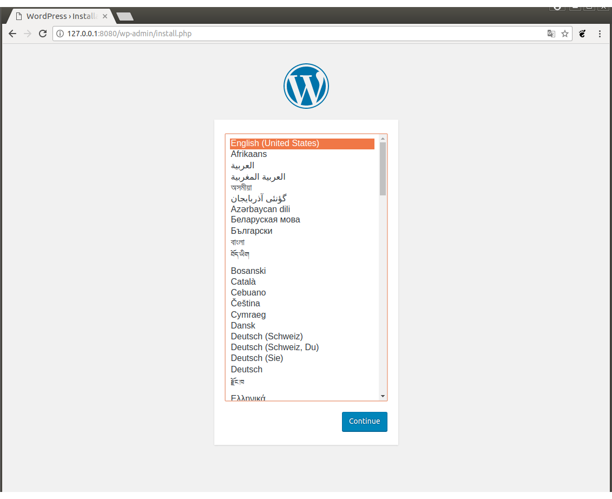
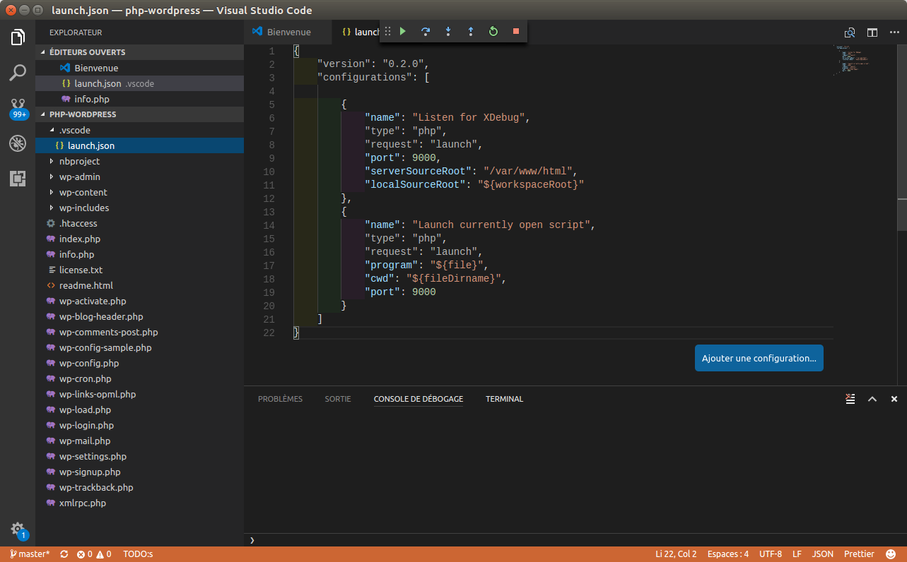

# WordPress.SandBox.Docker

```
Credentials WP : admin/admin
```

Environnement d'intégration de plugins pour WordPress. Persiste la base de données et les plugins dans les répertoires 'db-wordpress' et 'php-wordpress' du répertoire courant...

```
git clone 'https://github.com/venantvr/WordPress.SandBox.Docker.git
cd WordPress.SandBox.Docker
chmod +x wordpress-sandbox.sh
./wordpress-sandbox.sh 

```

```
renald@venantvr:~/wordpress-sandbox$ chmod +x wordpress-sandbox.sh 
renald@venantvr:~/wordpress-sandbox$ ./wordpress-sandbox.sh 
Creating network "wordpresssandbox_default" with the default driver
Creating wordpresssandbox_wordpress_1
Creating wordpresssandbox_mysql_1
Attaching to wordpresssandbox_mysql_1, wordpresssandbox_wordpress_1
wordpress_1  | WordPress not found in /var/www/html - copying now...
wordpress_1  | WARNING: /var/www/html is not empty - press Ctrl+C now if this is an error!
wordpress_1  | + ls -A
wordpress_1  | wp-content
wordpress_1  | + sleep 10
mysql_1      | Initializing database
mysql_1      | 2017-09-11T12:56:43.571140Z 0 [Warning] TIMESTAMP with implicit DEFAULT value is deprecated. Please use --explicit_defaults_for_timestamp server option (see documentation for more details).
mysql_1      | 2017-09-11T12:56:44.280993Z 0 [Warning] InnoDB: New log files created, LSN=45790
mysql_1      | 2017-09-11T12:56:44.465260Z 0 [Warning] InnoDB: Creating foreign key constraint system tables.
mysql_1      | 2017-09-11T12:56:44.533036Z 0 [Warning] No existing UUID has been found, so we assume that this is the first time that this server has been started. Generating a new UUID: a9eda37c-96f0-11e7-8aab-0242ac140002.
mysql_1      | 2017-09-11T12:56:44.534873Z 0 [Warning] Gtid table is not ready to be used. Table 'mysql.gtid_executed' cannot be opened.
mysql_1      | 2017-09-11T12:56:44.535255Z 1 [Warning] root@localhost is created with an empty password ! Please consider switching off the --initialize-insecure option.
mysql_1      | 2017-09-11T12:56:45.535147Z 1 [Warning] 'user' entry 'root@localhost' ignored in --skip-name-resolve mode.
mysql_1      | 2017-09-11T12:56:45.535163Z 1 [Warning] 'user' entry 'mysql.session@localhost' ignored in --skip-name-resolve mode.
mysql_1      | 2017-09-11T12:56:45.535185Z 1 [Warning] 'user' entry 'mysql.sys@localhost' ignored in --skip-name-resolve mode.
mysql_1      | 2017-09-11T12:56:45.535198Z 1 [Warning] 'db' entry 'performance_schema mysql.session@localhost' ignored in --skip-name-resolve mode.
mysql_1      | 2017-09-11T12:56:45.535205Z 1 [Warning] 'db' entry 'sys mysql.sys@localhost' ignored in --skip-name-resolve mode.
mysql_1      | 2017-09-11T12:56:45.535210Z 1 [Warning] 'proxies_priv' entry '@ root@localhost' ignored in --skip-name-resolve mode.
mysql_1      | 2017-09-11T12:56:45.535244Z 1 [Warning] 'tables_priv' entry 'user mysql.session@localhost' ignored in --skip-name-resolve mode.
mysql_1      | 2017-09-11T12:56:45.535250Z 1 [Warning] 'tables_priv' entry 'sys_config mysql.sys@localhost' ignored in --skip-name-resolve mode.
mysql_1      | Database initialized
mysql_1      | Initializing certificates
mysql_1      | Generating a 2048 bit RSA private key
mysql_1      | ....................+++
mysql_1      | ..........................+++
mysql_1      | unable to write 'random state'
mysql_1      | writing new private key to 'ca-key.pem'
mysql_1      | -----
mysql_1      | Generating a 2048 bit RSA private key
mysql_1      | ........................................+++
mysql_1      | ...................................................+++
mysql_1      | unable to write 'random state'
mysql_1      | writing new private key to 'server-key.pem'
mysql_1      | -----
mysql_1      | Generating a 2048 bit RSA private key
mysql_1      | ................................+++
mysql_1      | .........................................................................................................................................................................................+++
mysql_1      | unable to write 'random state'
mysql_1      | writing new private key to 'client-key.pem'
mysql_1      | -----
mysql_1      | Certificates initialized
mysql_1      | MySQL init process in progress...
mysql_1      | 2017-09-11T12:56:48.217393Z 0 [Warning] TIMESTAMP with implicit DEFAULT value is deprecated. Please use --explicit_defaults_for_timestamp server option (see documentation for more details).
mysql_1      | 2017-09-11T12:56:48.217917Z 0 [Note] mysqld (mysqld 5.7.19) starting as process 95 ...
mysql_1      | 2017-09-11T12:56:48.219805Z 0 [Note] InnoDB: PUNCH HOLE support available
mysql_1      | 2017-09-11T12:56:48.219817Z 0 [Note] InnoDB: Mutexes and rw_locks use GCC atomic builtins
mysql_1      | 2017-09-11T12:56:48.219821Z 0 [Note] InnoDB: Uses event mutexes
mysql_1      | 2017-09-11T12:56:48.219825Z 0 [Note] InnoDB: GCC builtin __atomic_thread_fence() is used for memory barrier
mysql_1      | 2017-09-11T12:56:48.219829Z 0 [Note] InnoDB: Compressed tables use zlib 1.2.3
mysql_1      | 2017-09-11T12:56:48.219833Z 0 [Note] InnoDB: Using Linux native AIO
mysql_1      | 2017-09-11T12:56:48.219990Z 0 [Note] InnoDB: Number of pools: 1
mysql_1      | 2017-09-11T12:56:48.220045Z 0 [Note] InnoDB: Using CPU crc32 instructions
mysql_1      | 2017-09-11T12:56:48.220918Z 0 [Note] InnoDB: Initializing buffer pool, total size = 128M, instances = 1, chunk size = 128M
mysql_1      | 2017-09-11T12:56:48.225156Z 0 [Note] InnoDB: Completed initialization of buffer pool
mysql_1      | 2017-09-11T12:56:48.226511Z 0 [Note] InnoDB: If the mysqld execution user is authorized, page cleaner thread priority can be changed. See the man page of setpriority().
mysql_1      | 2017-09-11T12:56:48.237847Z 0 [Note] InnoDB: Highest supported file format is Barracuda.
mysql_1      | 2017-09-11T12:56:48.243476Z 0 [Note] InnoDB: Creating shared tablespace for temporary tables
mysql_1      | 2017-09-11T12:56:48.243537Z 0 [Note] InnoDB: Setting file './ibtmp1' size to 12 MB. Physically writing the file full; Please wait ...
mysql_1      | 2017-09-11T12:56:48.274343Z 0 [Note] InnoDB: File './ibtmp1' size is now 12 MB.
mysql_1      | 2017-09-11T12:56:48.275930Z 0 [Note] InnoDB: 96 redo rollback segment(s) found. 96 redo rollback segment(s) are active.
mysql_1      | 2017-09-11T12:56:48.275953Z 0 [Note] InnoDB: 32 non-redo rollback segment(s) are active.
mysql_1      | 2017-09-11T12:56:48.277100Z 0 [Note] InnoDB: 5.7.19 started; log sequence number 2539315
mysql_1      | 2017-09-11T12:56:48.277564Z 0 [Note] InnoDB: Loading buffer pool(s) from /var/lib/mysql/ib_buffer_pool
mysql_1      | 2017-09-11T12:56:48.277936Z 0 [Note] Plugin 'FEDERATED' is disabled.
mysql_1      | 2017-09-11T12:56:48.280258Z 0 [Note] InnoDB: Buffer pool(s) load completed at 170911 12:56:48
mysql_1      | 2017-09-11T12:56:48.285199Z 0 [Note] Found ca.pem, server-cert.pem and server-key.pem in data directory. Trying to enable SSL support using them.
mysql_1      | 2017-09-11T12:56:48.285662Z 0 [Warning] CA certificate ca.pem is self signed.
mysql_1      | 2017-09-11T12:56:48.293222Z 0 [Warning] 'user' entry 'root@localhost' ignored in --skip-name-resolve mode.
mysql_1      | 2017-09-11T12:56:48.293274Z 0 [Warning] 'user' entry 'mysql.session@localhost' ignored in --skip-name-resolve mode.
mysql_1      | 2017-09-11T12:56:48.293294Z 0 [Warning] 'user' entry 'mysql.sys@localhost' ignored in --skip-name-resolve mode.
mysql_1      | 2017-09-11T12:56:48.293323Z 0 [Warning] 'db' entry 'performance_schema mysql.session@localhost' ignored in --skip-name-resolve mode.
mysql_1      | 2017-09-11T12:56:48.293332Z 0 [Warning] 'db' entry 'sys mysql.sys@localhost' ignored in --skip-name-resolve mode.
mysql_1      | 2017-09-11T12:56:48.293359Z 0 [Warning] 'proxies_priv' entry '@ root@localhost' ignored in --skip-name-resolve mode.
mysql_1      | 2017-09-11T12:56:48.295963Z 0 [Warning] 'tables_priv' entry 'user mysql.session@localhost' ignored in --skip-name-resolve mode.
mysql_1      | 2017-09-11T12:56:48.295998Z 0 [Warning] 'tables_priv' entry 'sys_config mysql.sys@localhost' ignored in --skip-name-resolve mode.
mysql_1      | 2017-09-11T12:56:48.308028Z 0 [Note] Event Scheduler: Loaded 0 events
mysql_1      | 2017-09-11T12:56:48.308543Z 0 [Note] mysqld: ready for connections.
mysql_1      | Version: '5.7.19'  socket: '/var/run/mysqld/mysqld.sock'  port: 0  MySQL Community Server (GPL)
mysql_1      | 2017-09-11T12:56:48.308564Z 0 [Note] Executing 'SELECT * FROM INFORMATION_SCHEMA.TABLES;' to get a list of tables using the deprecated partition engine. You may use the startup option '--disable-partition-engine-check' to skip this check. 
mysql_1      | 2017-09-11T12:56:48.308567Z 0 [Note] Beginning of list of non-natively partitioned tables
mysql_1      | 2017-09-11T12:56:48.323987Z 0 [Note] End of list of non-natively partitioned tables
mysql_1      | Warning: Unable to load '/usr/share/zoneinfo/iso3166.tab' as time zone. Skipping it.
mysql_1      | Warning: Unable to load '/usr/share/zoneinfo/leap-seconds.list' as time zone. Skipping it.
mysql_1      | Warning: Unable to load '/usr/share/zoneinfo/zone.tab' as time zone. Skipping it.
mysql_1      | 2017-09-11T12:56:50.606351Z 5 [Warning] 'user' entry 'root@localhost' ignored in --skip-name-resolve mode.
mysql_1      | 2017-09-11T12:56:50.606385Z 5 [Warning] 'user' entry 'mysql.sys@localhost' ignored in --skip-name-resolve mode.
mysql_1      | 2017-09-11T12:56:50.606402Z 5 [Warning] 'db' entry 'performance_schema mysql.session@localhost' ignored in --skip-name-resolve mode.
mysql_1      | 2017-09-11T12:56:50.606408Z 5 [Warning] 'db' entry 'sys mysql.sys@localhost' ignored in --skip-name-resolve mode.
mysql_1      | 2017-09-11T12:56:50.606417Z 5 [Warning] 'proxies_priv' entry '@ root@localhost' ignored in --skip-name-resolve mode.
mysql_1      | 2017-09-11T12:56:50.606448Z 5 [Warning] 'tables_priv' entry 'user mysql.session@localhost' ignored in --skip-name-resolve mode.
mysql_1      | 2017-09-11T12:56:50.606459Z 5 [Warning] 'tables_priv' entry 'sys_config mysql.sys@localhost' ignored in --skip-name-resolve mode.
mysql_1      | 
mysql_1      | 2017-09-11T12:56:50.608011Z 0 [Note] Giving 0 client threads a chance to die gracefully
mysql_1      | 2017-09-11T12:56:50.608030Z 0 [Note] Shutting down slave threads
mysql_1      | 2017-09-11T12:56:50.608033Z 0 [Note] Forcefully disconnecting 0 remaining clients
mysql_1      | 2017-09-11T12:56:50.608038Z 0 [Note] Event Scheduler: Purging the queue. 0 events
mysql_1      | 2017-09-11T12:56:50.608072Z 0 [Note] Binlog end
mysql_1      | 2017-09-11T12:56:50.608777Z 0 [Note] Shutting down plugin 'ngram'
mysql_1      | 2017-09-11T12:56:50.608789Z 0 [Note] Shutting down plugin 'ARCHIVE'
mysql_1      | 2017-09-11T12:56:50.608793Z 0 [Note] Shutting down plugin 'partition'
mysql_1      | 2017-09-11T12:56:50.608796Z 0 [Note] Shutting down plugin 'BLACKHOLE'
mysql_1      | 2017-09-11T12:56:50.608800Z 0 [Note] Shutting down plugin 'MyISAM'
mysql_1      | 2017-09-11T12:56:50.608811Z 0 [Note] Shutting down plugin 'MRG_MYISAM'
mysql_1      | 2017-09-11T12:56:50.608818Z 0 [Note] Shutting down plugin 'INNODB_SYS_VIRTUAL'
mysql_1      | 2017-09-11T12:56:50.608821Z 0 [Note] Shutting down plugin 'INNODB_SYS_DATAFILES'
mysql_1      | 2017-09-11T12:56:50.608823Z 0 [Note] Shutting down plugin 'INNODB_SYS_TABLESPACES'
mysql_1      | 2017-09-11T12:56:50.608829Z 0 [Note] Shutting down plugin 'INNODB_SYS_FOREIGN_COLS'
mysql_1      | 2017-09-11T12:56:50.608831Z 0 [Note] Shutting down plugin 'INNODB_SYS_FOREIGN'
mysql_1      | 2017-09-11T12:56:50.608834Z 0 [Note] Shutting down plugin 'INNODB_SYS_FIELDS'
mysql_1      | 2017-09-11T12:56:50.608836Z 0 [Note] Shutting down plugin 'INNODB_SYS_COLUMNS'
mysql_1      | 2017-09-11T12:56:50.608841Z 0 [Note] Shutting down plugin 'INNODB_SYS_INDEXES'
mysql_1      | 2017-09-11T12:56:50.608843Z 0 [Note] Shutting down plugin 'INNODB_SYS_TABLESTATS'
mysql_1      | 2017-09-11T12:56:50.608848Z 0 [Note] Shutting down plugin 'INNODB_SYS_TABLES'
mysql_1      | 2017-09-11T12:56:50.608850Z 0 [Note] Shutting down plugin 'INNODB_FT_INDEX_TABLE'
mysql_1      | 2017-09-11T12:56:50.608852Z 0 [Note] Shutting down plugin 'INNODB_FT_INDEX_CACHE'
mysql_1      | 2017-09-11T12:56:50.608854Z 0 [Note] Shutting down plugin 'INNODB_FT_CONFIG'
mysql_1      | 2017-09-11T12:56:50.608856Z 0 [Note] Shutting down plugin 'INNODB_FT_BEING_DELETED'
mysql_1      | 2017-09-11T12:56:50.608859Z 0 [Note] Shutting down plugin 'INNODB_FT_DELETED'
mysql_1      | 2017-09-11T12:56:50.608861Z 0 [Note] Shutting down plugin 'INNODB_FT_DEFAULT_STOPWORD'
mysql_1      | 2017-09-11T12:56:50.608863Z 0 [Note] Shutting down plugin 'INNODB_METRICS'
mysql_1      | 2017-09-11T12:56:50.608868Z 0 [Note] Shutting down plugin 'INNODB_TEMP_TABLE_INFO'
mysql_1      | 2017-09-11T12:56:50.608870Z 0 [Note] Shutting down plugin 'INNODB_BUFFER_POOL_STATS'
mysql_1      | 2017-09-11T12:56:50.608872Z 0 [Note] Shutting down plugin 'INNODB_BUFFER_PAGE_LRU'
mysql_1      | 2017-09-11T12:56:50.608876Z 0 [Note] Shutting down plugin 'INNODB_BUFFER_PAGE'
mysql_1      | 2017-09-11T12:56:50.608880Z 0 [Note] Shutting down plugin 'INNODB_CMP_PER_INDEX_RESET'
mysql_1      | 2017-09-11T12:56:50.608884Z 0 [Note] Shutting down plugin 'INNODB_CMP_PER_INDEX'
mysql_1      | 2017-09-11T12:56:50.608890Z 0 [Note] Shutting down plugin 'INNODB_CMPMEM_RESET'
mysql_1      | 2017-09-11T12:56:50.608893Z 0 [Note] Shutting down plugin 'INNODB_CMPMEM'
mysql_1      | 2017-09-11T12:56:50.608897Z 0 [Note] Shutting down plugin 'INNODB_CMP_RESET'
mysql_1      | 2017-09-11T12:56:50.608900Z 0 [Note] Shutting down plugin 'INNODB_CMP'
mysql_1      | 2017-09-11T12:56:50.608904Z 0 [Note] Shutting down plugin 'INNODB_LOCK_WAITS'
mysql_1      | 2017-09-11T12:56:50.608907Z 0 [Note] Shutting down plugin 'INNODB_LOCKS'
mysql_1      | 2017-09-11T12:56:50.608909Z 0 [Note] Shutting down plugin 'INNODB_TRX'
mysql_1      | 2017-09-11T12:56:50.608913Z 0 [Note] Shutting down plugin 'InnoDB'
mysql_1      | 2017-09-11T12:56:50.608994Z 0 [Note] InnoDB: FTS optimize thread exiting.
mysql_1      | 2017-09-11T12:56:50.609071Z 0 [Note] InnoDB: Starting shutdown...
mysql_1      | 2017-09-11T12:56:50.709459Z 0 [Note] InnoDB: Dumping buffer pool(s) to /var/lib/mysql/ib_buffer_pool
mysql_1      | 2017-09-11T12:56:50.710149Z 0 [Note] InnoDB: Buffer pool(s) dump completed at 170911 12:56:50
mysql_1      | 2017-09-11T12:56:52.322820Z 0 [Note] InnoDB: Shutdown completed; log sequence number 12143451
mysql_1      | 2017-09-11T12:56:52.324263Z 0 [Note] InnoDB: Removed temporary tablespace data file: "ibtmp1"
mysql_1      | 2017-09-11T12:56:52.324272Z 0 [Note] Shutting down plugin 'CSV'
mysql_1      | 2017-09-11T12:56:52.324275Z 0 [Note] Shutting down plugin 'MEMORY'
mysql_1      | 2017-09-11T12:56:52.324297Z 0 [Note] Shutting down plugin 'PERFORMANCE_SCHEMA'
mysql_1      | 2017-09-11T12:56:52.324313Z 0 [Note] Shutting down plugin 'sha256_password'
mysql_1      | 2017-09-11T12:56:52.324315Z 0 [Note] Shutting down plugin 'mysql_native_password'
mysql_1      | 2017-09-11T12:56:52.324405Z 0 [Note] Shutting down plugin 'binlog'
mysql_1      | 2017-09-11T12:56:52.324807Z 0 [Note] mysqld: Shutdown complete
mysql_1      | 
mysql_1      | 
mysql_1      | MySQL init process done. Ready for start up.
mysql_1      | 
mysql_1      | 2017-09-11T12:56:52.537159Z 0 [Warning] TIMESTAMP with implicit DEFAULT value is deprecated. Please use --explicit_defaults_for_timestamp server option (see documentation for more details).
mysql_1      | 2017-09-11T12:56:52.537691Z 0 [Note] mysqld (mysqld 5.7.19) starting as process 1 ...
mysql_1      | 2017-09-11T12:56:52.539593Z 0 [Note] InnoDB: PUNCH HOLE support available
mysql_1      | 2017-09-11T12:56:52.539605Z 0 [Note] InnoDB: Mutexes and rw_locks use GCC atomic builtins
mysql_1      | 2017-09-11T12:56:52.539607Z 0 [Note] InnoDB: Uses event mutexes
mysql_1      | 2017-09-11T12:56:52.539627Z 0 [Note] InnoDB: GCC builtin __atomic_thread_fence() is used for memory barrier
mysql_1      | 2017-09-11T12:56:52.539629Z 0 [Note] InnoDB: Compressed tables use zlib 1.2.3
mysql_1      | 2017-09-11T12:56:52.539630Z 0 [Note] InnoDB: Using Linux native AIO
mysql_1      | 2017-09-11T12:56:52.539859Z 0 [Note] InnoDB: Number of pools: 1
mysql_1      | 2017-09-11T12:56:52.539930Z 0 [Note] InnoDB: Using CPU crc32 instructions
mysql_1      | 2017-09-11T12:56:52.540854Z 0 [Note] InnoDB: Initializing buffer pool, total size = 128M, instances = 1, chunk size = 128M
mysql_1      | 2017-09-11T12:56:52.545126Z 0 [Note] InnoDB: Completed initialization of buffer pool
mysql_1      | 2017-09-11T12:56:52.546450Z 0 [Note] InnoDB: If the mysqld execution user is authorized, page cleaner thread priority can be changed. See the man page of setpriority().
mysql_1      | 2017-09-11T12:56:52.557738Z 0 [Note] InnoDB: Highest supported file format is Barracuda.
mysql_1      | 2017-09-11T12:56:52.563283Z 0 [Note] InnoDB: Creating shared tablespace for temporary tables
mysql_1      | 2017-09-11T12:56:52.563343Z 0 [Note] InnoDB: Setting file './ibtmp1' size to 12 MB. Physically writing the file full; Please wait ...
mysql_1      | 2017-09-11T12:56:52.593998Z 0 [Note] InnoDB: File './ibtmp1' size is now 12 MB.
mysql_1      | 2017-09-11T12:56:52.595620Z 0 [Note] InnoDB: 96 redo rollback segment(s) found. 96 redo rollback segment(s) are active.
mysql_1      | 2017-09-11T12:56:52.595646Z 0 [Note] InnoDB: 32 non-redo rollback segment(s) are active.
mysql_1      | 2017-09-11T12:56:52.596801Z 0 [Note] InnoDB: Waiting for purge to start
mysql_1      | 2017-09-11T12:56:52.647231Z 0 [Note] InnoDB: 5.7.19 started; log sequence number 12143451
mysql_1      | 2017-09-11T12:56:52.648044Z 0 [Note] InnoDB: Loading buffer pool(s) from /var/lib/mysql/ib_buffer_pool
mysql_1      | 2017-09-11T12:56:52.648380Z 0 [Note] Plugin 'FEDERATED' is disabled.
mysql_1      | 2017-09-11T12:56:52.653838Z 0 [Note] InnoDB: Buffer pool(s) load completed at 170911 12:56:52
mysql_1      | 2017-09-11T12:56:52.655495Z 0 [Note] Found ca.pem, server-cert.pem and server-key.pem in data directory. Trying to enable SSL support using them.
mysql_1      | 2017-09-11T12:56:52.655950Z 0 [Warning] CA certificate ca.pem is self signed.
mysql_1      | 2017-09-11T12:56:52.660031Z 0 [Note] Server hostname (bind-address): '*'; port: 3306
mysql_1      | 2017-09-11T12:56:52.660092Z 0 [Note] IPv6 is available.
mysql_1      | 2017-09-11T12:56:52.660107Z 0 [Note]   - '::' resolves to '::';
mysql_1      | 2017-09-11T12:56:52.660132Z 0 [Note] Server socket created on IP: '::'.
mysql_1      | 2017-09-11T12:56:52.664624Z 0 [Warning] 'user' entry 'root@localhost' ignored in --skip-name-resolve mode.
mysql_1      | 2017-09-11T12:56:52.664687Z 0 [Warning] 'user' entry 'mysql.sys@localhost' ignored in --skip-name-resolve mode.
mysql_1      | 2017-09-11T12:56:52.664718Z 0 [Warning] 'db' entry 'performance_schema mysql.session@localhost' ignored in --skip-name-resolve mode.
mysql_1      | 2017-09-11T12:56:52.664731Z 0 [Warning] 'db' entry 'sys mysql.sys@localhost' ignored in --skip-name-resolve mode.
mysql_1      | 2017-09-11T12:56:52.664748Z 0 [Warning] 'proxies_priv' entry '@ root@localhost' ignored in --skip-name-resolve mode.
mysql_1      | 2017-09-11T12:56:52.669047Z 0 [Warning] 'tables_priv' entry 'user mysql.session@localhost' ignored in --skip-name-resolve mode.
mysql_1      | 2017-09-11T12:56:52.669083Z 0 [Warning] 'tables_priv' entry 'sys_config mysql.sys@localhost' ignored in --skip-name-resolve mode.
mysql_1      | 2017-09-11T12:56:52.681506Z 0 [Note] Event Scheduler: Loaded 0 events
mysql_1      | 2017-09-11T12:56:52.681904Z 0 [Note] mysqld: ready for connections.
mysql_1      | Version: '5.7.19'  socket: '/var/run/mysqld/mysqld.sock'  port: 3306  MySQL Community Server (GPL)
mysql_1      | 2017-09-11T12:56:52.681944Z 0 [Note] Executing 'SELECT * FROM INFORMATION_SCHEMA.TABLES;' to get a list of tables using the deprecated partition engine. You may use the startup option '--disable-partition-engine-check' to skip this check. 
mysql_1      | 2017-09-11T12:56:52.681952Z 0 [Note] Beginning of list of non-natively partitioned tables
mysql_1      | 2017-09-11T12:56:52.694071Z 0 [Note] End of list of non-natively partitioned tables
wordpress_1  | Complete! WordPress has been successfully copied to /var/www/html
wordpress_1  | AH00558: apache2: Could not reliably determine the server's fully qualified domain name, using 172.20.0.3. Set the 'ServerName' directive globally to suppress this message
wordpress_1  | AH00558: apache2: Could not reliably determine the server's fully qualified domain name, using 172.20.0.3. Set the 'ServerName' directive globally to suppress this message
wordpress_1  | [Mon Sep 11 12:56:53.884447 2017] [mpm_prefork:notice] [pid 1] AH00163: Apache/2.4.10 (Debian) PHP/5.6.31 configured -- resuming normal operations
wordpress_1  | [Mon Sep 11 12:56:53.884488 2017] [core:notice] [pid 1] AH00094: Command line: 'apache2 -D FOREGROUND'

```

You're done !!



Pour autoriser le débogage dans VsCode, ouvrir le volume local mappé sur /var/www/html, et configurer le fichier launch.json du projet ainsi constitué :




